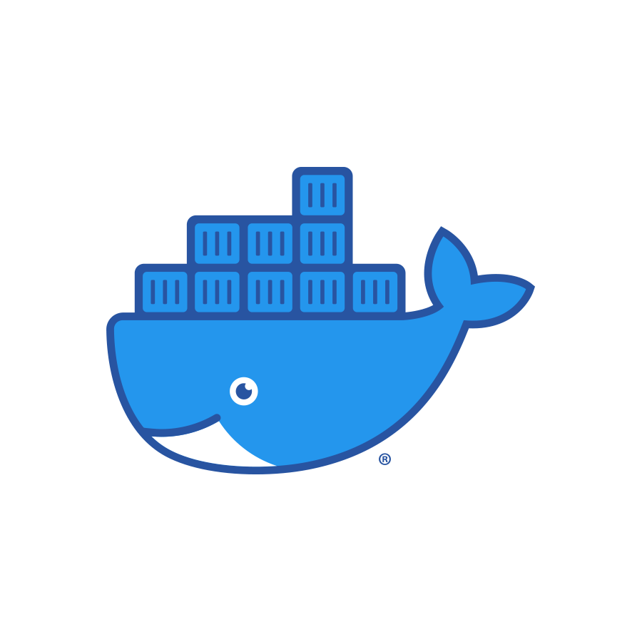

# Docker



## List of commands

detailed list: https://docs.docker.com/engine/reference/commandline/docker/

- `docker pull` (downloads an image from the Container-Registry)
- `docker build` (creates an image based on an existing Dockerfile)
- `docker run` (starts a container from an image)
- `docker stop` (stops a running container)
- `docker kill` (stops a running container, similar to docker stop)
- `docker start` (restarts a stopped container)
- `docker compose` (used for working with multiple containers at once)
- `docker push` (uploads an image to the Container-Registry)
- `docker images` (lists all local images)
- `docker ps` (lists all running containers)
- `docker rm` (deletes a container)
- `docker exec` (executes a command in a container)

**Hint**: for some commands there are old and new versions

example:

```shell
$ docker ps (old)
```

```shell
$ docker container ps (new)
```

---

```shell
$ docker build (old)
```

```shell
$ docker image build (new)
```

the output will be the same

## Terminology

- **Dockerfile**: The Dockerfile describes the steps necessary to build an image. This includes for example copying files, setting environment variables, and installing dependencies. It also includes the command that will be executed when starting the image.
- **Image**: An image is created using the `docker build` command and a Dockerfile. An image contains all configuration files, dependencies, environment variables and the source code used to run the application. An image is a template for a container and can not be changed. It can only be rebuilt.
- **Container**: Containers are created using the `docker run` command. Every container behaves as if it had an own file system and operating system. A container uses the Linux kernel as host system (this is also the reason why Docker requires WSL on Windows). This is one of the reasons why Docker containers are so lightweigt and fast. They are isolated from the rest of the operating system. An image can be used to start any amount of containers. Files will be saved to the container by default. If the container is deleted, all files within the container will be lost.
- **docker-compose.yml**: Most applications need several components, like a website and a database. These components can be represented with a docker-compose file. It lists the required images and other settings, like port-forwarding and volumes. The `docker compose` command can be used to start or stop multiple containers.
- **.dockerignore Datei**: Similar to a .gitignore file. The .dockerignore file contains all folders and files that should not be copied to the image (for example log files or the node_modules folder).
- **Docker Hub**: A central place to store images. Here you can find images of different linux-distros, such as Ubuntu, Arch or Alpine. You can also find all kinds of other software-images there, like Postgres, Wordpress, Python, NextCloud or NodeJS. On the one hand, there is the official registry located at https://hub.docker.com on the other hand there are registries offered by popular cloud hosting services, such as Azure or AWS. It is also possible to host your own registry.

## Commands

- To start a Wordpress container, run `docker run --name mein-wordpress -p 8080:80 -d wordpress`
- To view the running container, run `docker ps`
- To start the website locally, run `node index.js` (don't forget to stop this running process before moving on, since there will be conflicting ports. This also applies to later steps)
- To build the Dockerfile for the example website, run `docker build -t demo:1` in the expressApp directory
- To view a list of all available images, run `docker images`
- To run the image that was just built, execute `docker run -d -p 5000:5000 demo:1`
- To view the running container, execute `docker ps`
- To stop the container, execute `docker kill` or `docker stop` followed by either the id of the container or the name
- To view all containers, execute `docker ps -a`, this will show all containers, including stopped ones
- To start a container, execute `docker start` followed by either the id of the container or the name
- To mount a volume for persistent storage outside the container, execute `docker run -d -p 5000:5000 -v C:/Path/To/Directory/On/Host:/Directory/In/Container demo:1`. Note that the host path has to be absolute.
- To open a shell or execute other commands in the container, run `docker exec -it <ID or name> sh`
- To use docker compose, change to last line of the dockerfile from

```Dockerfile
CMD node index.js
```

to

```Dockerfile
CMD node index2.js
```

- Then run `docker compose up -d` in the expressApp directory. To stop the containers, execute `docker compose down`

### Meaning of options

- -d -> detached
- -t -> tag
- -p -> publish
- -v -> volume

## Installation

---

### Hint

It is possible to use a virtual machine in the cloud [Alternatives](#Alternatives)

---

the Docker Engine is required

https://docs.docker.com/get-docker/

to check the installation, execute:

```shell
$ docker run hello-world
```

You will also need Docker compose (Docker compose is included with Docker Desktop under Windows and macOs)

https://docs.docker.com/compose/install/

to check the installation, execute:

```shell
$ docker compose version
```

or

```shell
$ docker-compose --version
```

### Hint for Windows

WSL (=Windows subsystem for Linux) is required. To use WSL, hardware-virtualization has to be enabled.

### Alternatives

Play with Docker Website: https://labs.play-with-docker.com/

To use this site, a free Docker account is required. After clicking on "start" you can click on "add new instance" to start a virtual machine in the cloud. This virtual machine comes with docker preinstalled.

## Links

- Documentation: https://docs.docker.com/
- Installation: https://docs.docker.com/get-docker/
- Play with Docker Website: https://labs.play-with-docker.com/
- Dockerhub Container-Registry: https://hub.docker.com/
